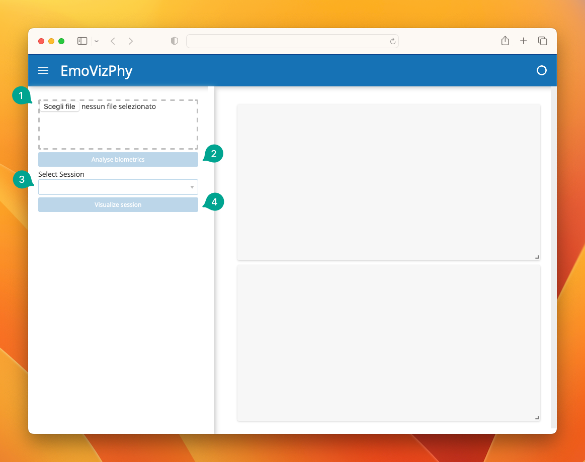

# EmoVizPhy

## Prerequisites

EmoVizPhy is distributed as a Docker image on the GitHub Container Registry.
To download and run the image, you must have Docker installed on your system.
If you need to install Docker, please refer to the [official guide](https://docs.docker.com/get-docker/).

## Getting Started

To run EmoVizPhy, first pull the image from the GitHub Container Registry:

- for Mac computers with Apple Silicon processors (e.g., M1):

  ```shell
  docker pull ghcr.io/collab-uniba/stressawareness:arm64-latest
  ```

- for Windows computers with 64-bit processors:

  ```shell
  docker pull ghcr.io/collab-uniba/stressawareness:win64-latest
  ```

Then, run the image in a Docker container:

- for Mac computers with Apple Silicon processors (e.g., M1):

  ```shell
  docker run --rm -it -p 20000:20000 ghcr.io/collab-uniba/stressawareness:arm64-latest
  ```

- for Windows computers with 64-bit processors:

  ```shell
  docker run --rm -it -p 20000:20000 ghcr.io/collab-uniba/stressawareness:win64-latest
  ```

Once the container is running, your terminal will display the URL to access the EmoVizPhy web interface:

```shell
Launching server at http://localhost:20000
```

## Usage

Open the URL in your browser to access the EmoVizPhy web interface.



1. By clicking on the "Select file" button, choose a `.zip` archive on your computer that includes the `Data/` and `Popup/` folders, respectively containing biometric data and popup annotations.
2. Once it becomes active, click on the "Analyse biometrics" button, then wait for the analysis to complete (this might take a few minutes).
3. Once the analysis is complete, you can select the session to visualize from the dropdown menu
4. and click on the "Visualize session" button to populate the dashboard.

## Contributing

### Sharing a new version of the Docker image

To share a new version of the EmoVizPhy Docker image, you need to have a GitHub account
with write permissions on the [collab-uniba GitHub organization](https://github.com/collab-uniba).

1. Build a new version of the Docker image using the labels shown in the following example
   (replace the example tag – i.e., `arm64-latest` – with the desired tag for the new image version):

    ```shell
    docker build \
    --label "org.opencontainers.image.source=https://github.com/collab-uniba/stress_awareness" \
    --label "org.opencontainers.image.description=Visualization tool for biometric data." \
    --pull --rm -f "Dockerfile" -t ghcr.io/collab-uniba/stressawareness:arm64-latest "."
    ```

2. Push the newly created image to the GitHub Container Registry
   (replace the example tag – i.e., `arm64-latest` – with the desired tag for the new image version):

    ```shell
    docker push ghcr.io/collab-uniba/stressawareness:arm64-latest
    ```
